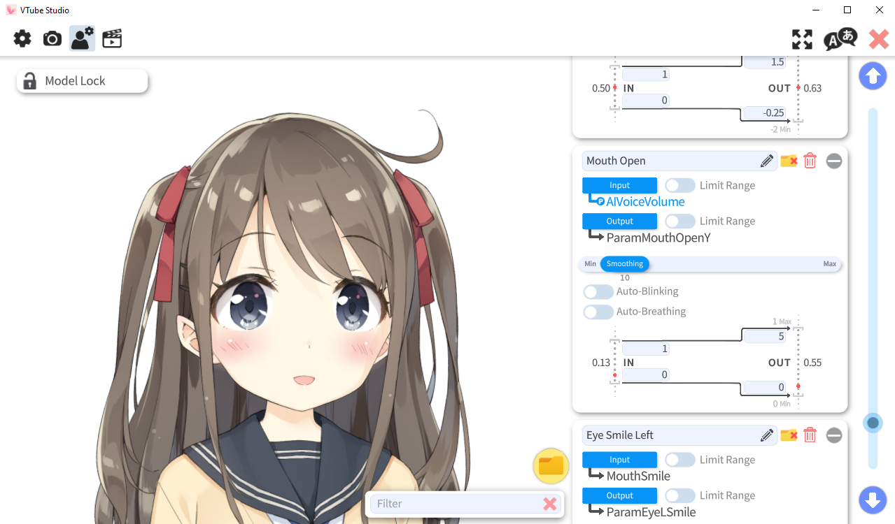
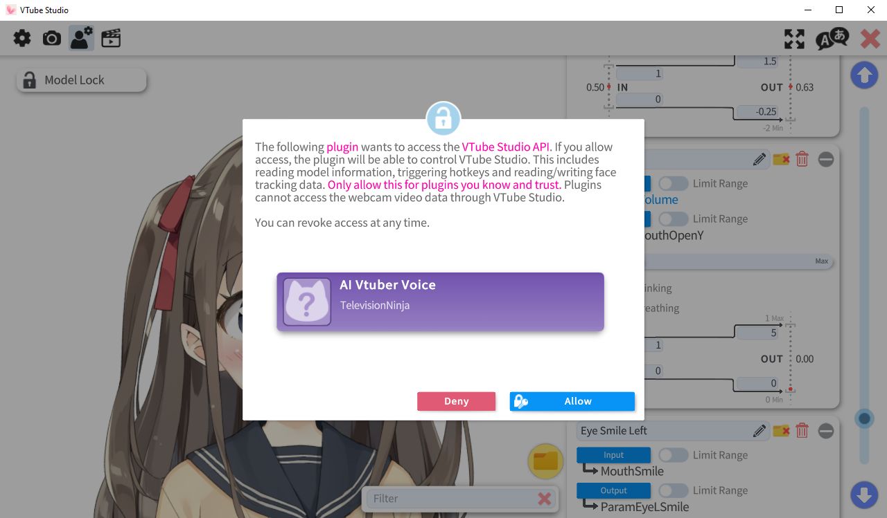
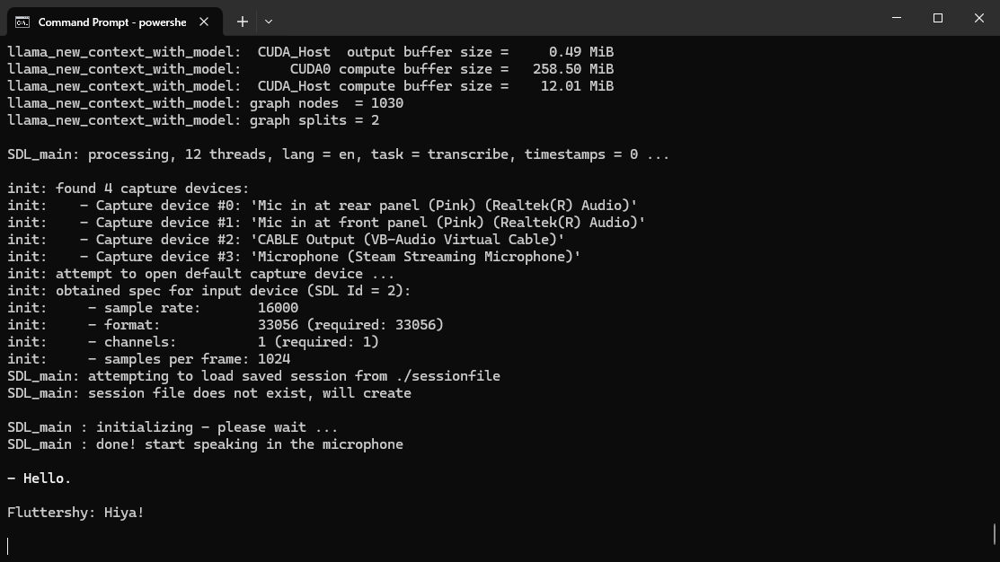
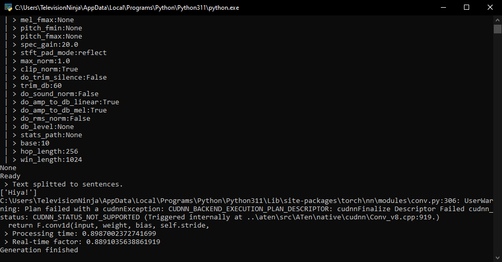

# chat
Chat with an AI Vtuber






Uses:
- whisper.cpp
- llama.cpp
- Coqui TTS
- VTube Studio


# Clone The Repository
```bash
git clone --recurse-submodules https://github.com/TelevisionNinja/chat.git
```


# Install Dependencies

## VTube Studio
Download and install VTube Studio from Steam

## eSpeak-NG
### Linux and MacOS
```bash
sudo apt install espeak-ng
```

### Windows
Download and install the msi variant from https://github.com/espeak-ng/espeak-ng/releases

## Python
### Python Install
#### Linux and MacOS
1. Download and install Python 3.11
2. cd into the repository ```cd ./chat``
3. Create the virtual environment ```python3.11 -m venv venv```
4. Activate the virtual environment ```source ./venv/bin/activate```
5. Install the Python Dependencies below into the virtual environment

#### Windows
Download and install Python 3.11


### Pytorch
Install Pytorch by following the 'Get Started' instructions from the website

### RVC
```bash
```

### Python Dependencies
```bash
pip install TTS sounddevice pyvts
```

## Linux
```bash
sudo apt install make gcc g++ libsdl2-dev
```

### CUDA
```bash
sudo apt install nvidia-cuda-toolkit
```

## MacOS
Install brew with
```bash
/bin/bash -c "$(curl -fsSL https://raw.githubusercontent.com/Homebrew/install/HEAD/install.sh)"
```
Install Dependencies with
```bash
brew install make gcc sdl2
```

## Windows
### CUDA
1. Download and install Visual Studio and the C++ workload from Microsoft
2. Download and install the CUDA Toolkit from the Nvidia developer website

### SDL
1. Download the VC variant from https://github.com/libsdl-org/SDL/releases
2. Extract to the directory ```./src/llama.cpp```
3. Rename the extracted folder to ```SDL2```

### VB-Cable
Download and install VB-Cable by VB-Audio Software


# Build

## Linux
With CUDA
```bash
cd ./src/llama.cpp

make -j GGML_CUDA=1

cd ../..
```

Without CUDA
```bash
cd ./src/llama.cpp

make -j

cd ../..
```

## MacOS
```bash
cd ./src/llama.cpp

make -j

cd ../..
```

## Windows
Use ```Command Prompt```

With CUDA
```bash
cd ./src/llama.cpp

set SDL2_DIR=SDL2\cmake

cmake -DWHISPER_SDL2=ON -DGGML_CUDA=ON -B build
cmake --build build --config release -j

cd ../..
```

Without CUDA
```bash
cd ./src/llama.cpp

set SDL2_DIR=SDL2\cmake

cmake -DWHISPER_SDL2=ON -B build
cmake --build build --config release -j

cd ../..
```


# Make Scripts Executable

## Linux and MacOS
```bash
sudo chmod +x ./src/llama.cpp/common/talk/speak.sh
sudo chmod +x ./launch.sh
```


# Run
1. Launch VTube Studio

2. Run the launch script
    ## Linux and MacOS
    ```bash
    ./launch.sh
    ```

    ## Windows
    ```bash
    powershell .\launch.ps1
    ```

3. Click on the allow button for the plugin to function

4. Go to the model settings and change the input to ```AIVoiceVolume``` in the ```Mouth Open``` section
